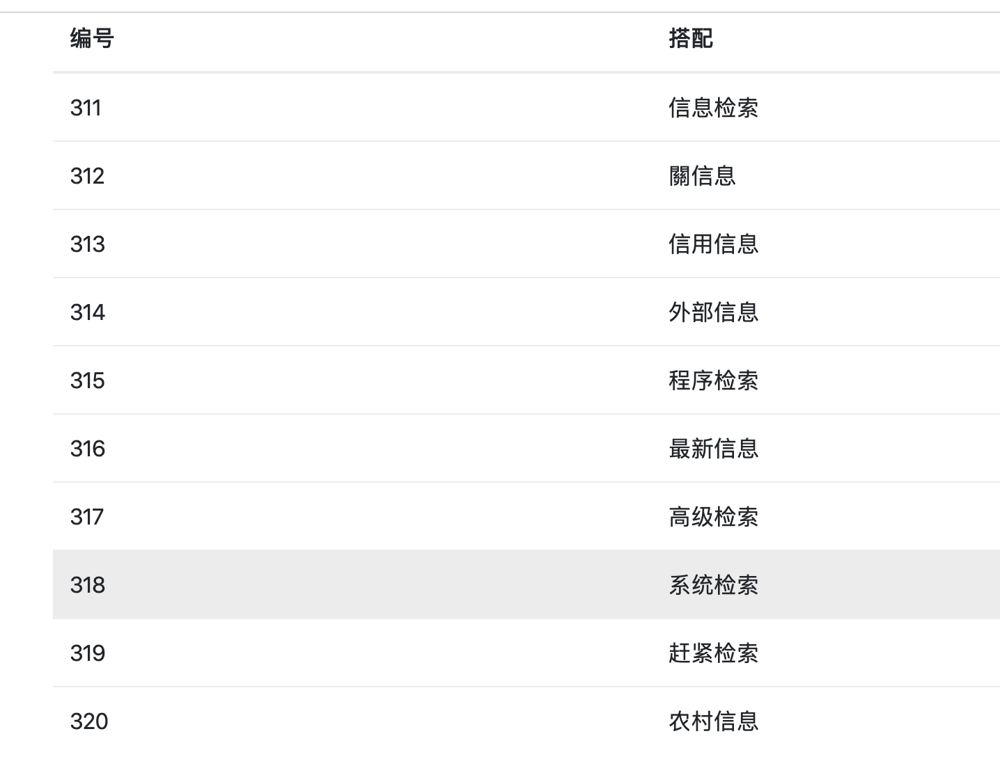

# 信息检索 -- 中文搭配检索系统

<center>王琛 计65 2016011360</center>

## 一、实验目标

实现一个完整的信息检索系统并完成如下功能：

- 􏰾􏰉􏰙􏰱􏰫􏰶􏰷􏰸􏰹􏰞􏰿􏱀􏱁􏰔􏱂􏱃 返回关键词的常见搭配结果

- 􏰾􏰉􏰙􏰱􏰫􏰶􏰷􏰸􏰹􏰞􏰿􏱀􏱁􏰔􏱂􏱃 给定返回关键词的词性，返回搭配结果
- 给定检索词和关键词的距离限制，返回常见的搭配结果
- 给定多个关键词返回相应的结果
- 分词和不分词对结果的影响


## 二、实验环境

- 系统及API版本：macOS Catalina, python 3.7.3, ElasticSearch 6.8.5, Flask 1.1.1
- 文档选择：我使用了本组处理过的所有Sogou语料以及所有的人民日报语料，我认为这些语料能够基本满足功能实现的需求，过多语料会占用比较多的磁盘空间。


## 三、具体实现

### 1. 索引构建

我使用了ElasticSearch进行了索引的构建。首先创建index，需要将"analyzer"设置成"whitespace"，因为我们已经预先分好词，否则系统将调用自动的分词器进行分词

```python
        body = {
            "mappings": {
                '_doc': {
                    "properties": {
                        "content": {
                            "type": "text",
                            "analyzer": "whitespace"
                        }
                    }
                }
            }
        }
        if not self.es.indices.exists(self.idx_name):
            self.es.indices.create(index=self.idx_name, body=body)
```

创建好index之后，可以向对应的index中添加文档，我使用了bulk的方式添加，即一次添加多条，能够提升效率，核心代码如下：

```python
 for idx, line in enumerate(lines):
    action.append({
        "_index": self.idx_name,
        "_type": "_doc",
        "_id": self.id_cnt,
        "_source": {
            "content": line.strip()
        }
    })
 bulk(self.es, action)
```

可以看到，在添加时我只添加了文档的内容，并没有设置额外的字段，这样能够占用比较少的空间。


### 2. 搜索功能的实现

实现思路：这次作业的主要任务是输入关键词返回对应的结果，因此最重要的是根据关键词返回对应的文档。由于ElasticSearch支持使用正则表达式进行搜索，所以用户可以选择任意的词性以及传入多个关键词，后台会构建相应的正则表达式。对于距离的要求，我的做法是先取出对应的文档，然后在文档中找出关键词后，获得关键词指定窗口中的内容。

利用正则表达式进行搜索的代码如下：

```python
def search_docs(self, keywords, pos=None, size=300):
    regexp = str()
    for word in keywords:
        regexp += self.build_word_re(word, pos)
    regexp = regexp[:-1]
    print(regexp)
    print(self.idx_name)
    body = {
        "size": size,
        "query": {
            "regexp": {
                "content": {
                    "value" : regexp
                }
            }
        }
    }
    docs = self.es.search(index=self.idx_name, body=body)
    return docs
```

其中，`keywords`是关键词的list，`pos`是所有词性构成的list。代码中对于每个关键词构建正则表达式，然后将所有的关键词的正则表达式合并。

前面提到，获取对应的文档后，会根据窗口大小获得最终的结果，代码如下：

```python
def retrieve_single(es, keywords, win_size, POS=None):
    raw_docs = es.search_docs(keywords, POS)['hits']['hits']
    docs = [r['_source']['content'] for r in raw_docs]
    result = set()
    for doc in docs:
        word_list = doc.split(" ")
        for idx, word in enumerate(word_list):
            if word[:-2] in keywords:
                win_data = word_list[max(0, idx-win_size): idx+1]
                if(len(win_data) > 0):
                    result.add(get_window(win_data))
                win_data = word_list[idx: min(idx+win_size, len(word))]
                if(len(win_data) > 0):
                    result.add(get_window(win_data))
    return result

def get_window(win_data):
    return "".join(map(lambda x: x[:-2], win_data)
```

其中，`get_window`函数会返回关键词窗口的数据。


### 3. Demo的搭建

根据要求，使用Flask搭建了demo。主要有两个函数，其中`index_page`返回搜索页面，用户可以输入关键词，选择词性和窗口大小；`show_result`函数展示关键词搭配的结果，使用`pagination`进行分页显示。


## 四、实验结果

### 1. 返回关键词常见搭配结果

输入“进攻”，返回结果如下：

<figure class="third">
    
    
</figure>

### 2. 根据关键词词性返回结果

搜索“检索”和动词限制，返回结果如下：


搜索“检索”不搜索动词，返回结果如下：


在实验中发现，虽然返回的结果很多，但是由于分词工具的原因，绝大多数的关键词都是一个词性，导致搜索其他词性出现的结果非常少，甚至没有。我尝试了其他的关键词，例如“进攻”，“攻击”，只出现了动词的结果。

### 3. 给定距离限制，返回结果

默认情况下，窗口大小为1。

搜索信息，窗口大小为2和3时，结果如下：

<figure class="third">
    
    
</figure>

可以看到，返回的搭配还是十分常见的。


### 4. 给定多个关键词

搜索“信息 检索”，结果如下：


可以看到，结果中出现了信息和检索两个关键词的结果，在后面的位置也出现了“信息检索”的结果，



事实上，我认为多个关键词的搜索在本系统的意义并不大，因为我们是找关键词搭配。在寻找结果时，仍然是每个关键词分开寻找的，只是最后将结果合并。如果两个关键词的语义相关性不大，则和两个分开再合并没有差别。


### 5. 分词和不分词的影响

如果不分词，则无法根据词性进行查找，会影响用户的使用效果。另外，在对窗口进行处理时，也无法准确取出窗口的数据。但是，如果分词不准确，可能对一些专有的名词造成影响，导致无法得到结果。


## 五、实验总结

这次试验，我使用ElasticSearch制作了一个简单的中文搭配检索系统，了解了如何构建一个搜索系统。我觉得这次实验让我在课堂上的知识学到了运用，并且构建的检索系统返回的搭配结果也是有很多语义信息的。现在的缺陷在于没有对最后的结果进行很好的处理，如果将重要的结果放在前面，则效果会更好。